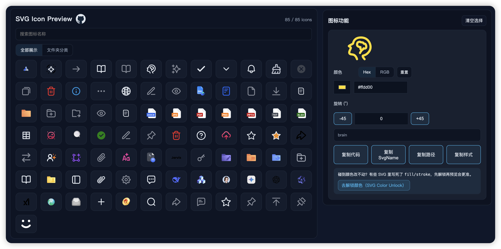

# svg-icon-types

自动扫描 `SVG` 目录，生成类型声明和可视化预览页面的 Vite 插件。用来给类似 `SvgIcon` 组件的 `name` 属性提供字面量类型提示，同时提供一个无需额外配置的图标预览/复制界面。

## 效果预览



## 功能

- 扫描目录：默认 `src/assets/svg`，递归收集 `.svg`
- 类型声明：生成 `src/types/generated-svg-names.d.ts`，按字典序输出 union
- 预览页面：生成 `tmp/icon-preview/generated-preview.vue`、`tmp/icon-preview/main.ts`、`tmp/icon-preview.html`
- 多入口：自动把 `icon-preview.html` 注入 Vite/Rollup `input`
- Watch：dev 时监听 SVG 变更，自动重生成
- 防抖写入：内容不变不重写，避免 HMR 死循环

## 安装

```
pnpm add -D vite-plugin-svg-icon-types
# 或 npm/yarn
```

## 使用

```ts
// vite.config.ts
import svgIconTypes from "vite-plugin-svg-icon-types";

export default defineConfig({
  plugins: [svgIconTypes()],
});
```

CommonJS 也可直接使用：

```js
// vite.config.cjs
const svgIconTypes = require("vite-plugin-svg-icon-types").default;

module.exports = {
  plugins: [svgIconTypes()],
};
```

启动 dev：`pnpm dev`，访问 `http://localhost:xxxx/tmp/icon-preview.html`（按你的 host/port 调整）。

## 预览页能力

- 搜索：按名称或相对路径（不含 .svg）
- 点击单个图标，进入图标操作面板
- 如遇到颜色锁定（fill/stroke 固定颜色）无法修改的问题，可在 [svg-color-unlock](https://xietiansheng.github.io/svg-color-unlock/) 项目快速修改源码

## 默认生成的文件

> 建议将 `/tmp` 目录加入 `.gitignore`

- `src/types/generated-svg-names.d.ts`

- `tmp/icon-preview/generated-preview.vue`
- `tmp/icon-preview/main.ts`
- `tmp/icon-preview.html`（作为多入口）

## 可选配置

```ts
// ⚠️ 以下所有参数均为默认值，所有参数均为可选
svgIconTypes({
  // 扫描目录
  iconsDir: "src/assets/svg",
  // 类型输出
  output: "src/types/generated-svg-names.d.ts",
  // 预览页面输出
  previewVueOutput: "tmp/icon-preview/generated-preview.vue",
  // 预览页面 main.ts 输出
  previewMainOutput: "tmp/icon-preview/main.ts",
  // 预览页面 html 输出
  previewHtmlOutput: "tmp/icon-preview.html",
  // 文件变更防抖时间（毫秒）
  debounceMs: 100,
});
```

## 约定

- 图标名称由文件相对路径用 `-` 连接得到（目录/文件名中的 `/` -> `-`），去掉 `.svg`
- 需在项目中有一个组件 `<SvgIcon :name="SvgIconName" />`，配合 `virtual:svg-icons-register` 等雪碧图注册方式使用
- 生成的类型声明文件中，类型名为 `SvgIconName`
- 预览页面路径为 `/tmp/icon-preview.html`
- 预览页面使用 Vue 3 + Vite 构建

## 问题反馈与建议

如有任何问题或建议，欢迎在 [GitHub 仓库](https://github.com/xietiansheng/vite-plugin-svg-icon-types) 提交 issue 或 PR。
